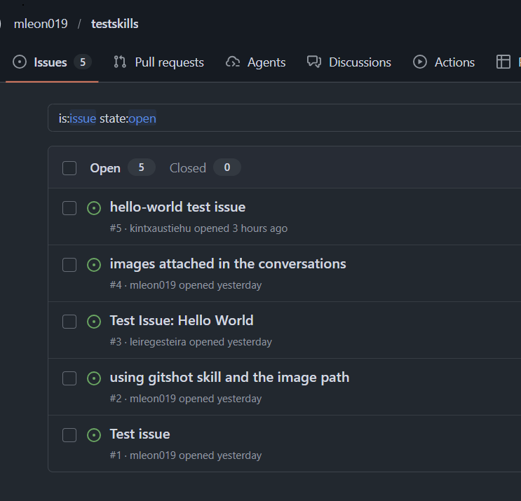
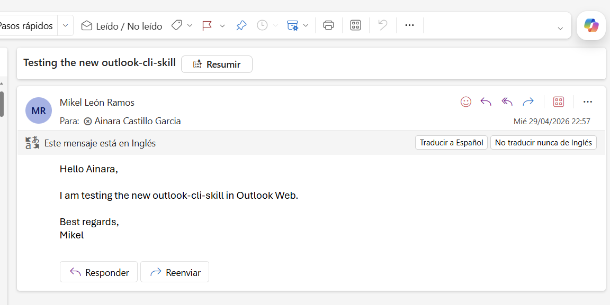

# testskills

## Skills Lab 2 Summary

In the second lab, I automated GitHub issue creation with images and documented the workflow for pasted chat images. The work covered these steps:

- Used `gh` CLI to create test issues and verify creation in my repo and a classmate's repo.
- Evaluated the `gitshot` project for security at a high level before using it.
- Installed and used `gitshot` via `npx` to upload images and include them in issue bodies.
- Identified where VS Code stores pasted chat images on Windows and updated the `gitshot` skill with a lookup command to fetch the latest image path.
- Tested the updated skill by pasting an image, locating its path, and creating an issue/comment that included the image.

- Created and tested a playwright-cli-outlook skill to use the web version of Outlook to send an email.
